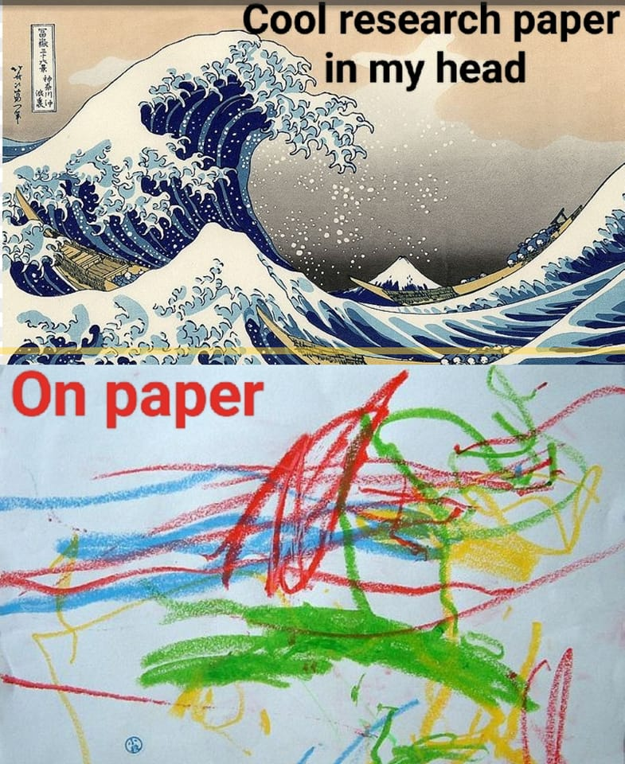

# Interactive Data Visualization Portfolio
Portfolio for Interactive Data Visualization (Spring 2023)
Ian G. Williams

Welcome to my portfolio! It has has four components

1. Stable links to all tutorials.
2. Abstract for updated tutorial
2. Abstract for final project
3. Reflection on the process and the course

##### **1. Links to projects**
| Section | Tutorial | Link To Deployment | Link To Code |
| -------------- |--------- |---------------- |  -----|
| Section 1 | Tutorial 1 | https://perlsdiver.github.io/Interactive-Data-Vis-Spring2023/1_1_getting_started/index.html | https://github.com/perlsdiver/Interactive-Data-Vis-Spring2023/tree/main/1_1_getting_started |
| Section 1 | Tutorial 2 | https://perlsdiver.github.io/Interactive-Data-Vis-Spring2023/1_2_basic_html/index.html | https://github.com/perlsdiver/Interactive-Data-Vis-Spring2023/tree/main/1_2_basic_html |
| Section 1 | Tutorial 3 | https://perlsdiver.github.io/Interactive-Data-Vis-Spring2023/1_3_intro_to_js/index.html | https://github.com/perlsdiver/Interactive-Data-Vis-Spring2023/tree/main/1_3_intro_to_js |
| Section 2 | Tutorial 1 | https://perlsdiver.github.io/Interactive-Data-Vis-Spring2023/2_1_quantities_and_amounts/index.html | https://github.com/perlsdiver/Interactive-Data-Vis-Spring2023/tree/main/2_1_quantities_and_amounts |
| Section 2 | Tutorial 2 | https://perlsdiver.github.io/Interactive-Data-Vis-Spring2023/2_2_distributions/index.html | https://github.com/perlsdiver/Interactive-Data-Vis-Spring2023/tree/main/2_2_distributions |
| Section 2 | Tutorial 3 | https://perlsdiver.github.io/Interactive-Data-Vis-Spring2023/2_3_time_series/index.html | https://github.com/perlsdiver/Interactive-Data-Vis-Spring2023/tree/main/2_3_time_series | 
| Section 2 | Tutorial 4 | https://perlsdiver.github.io/Interactive-Data-Vis-Spring2023/2_4_geographic/index.html | https://github.com/perlsdiver/Interactive-Data-Vis-Spring2023/tree/main/2_4_geographic | 
| Final | Final Project | https://perlsdiver.github.io/InteractiveDataVizPortfolio/FinalProject/index.html | https://github.com/perlsdiver/InteractiveDataVizPortfolio/tree/main/FinalProject | 

##### **2. Abstract for updated tutorial**

Section 2, Tutorial 3: Time Series

This visualization demonstrates how to make an area chart with a small data set, with a tooltip. It depicts annual population estimates of persons experiencing homelesssness in the United States from 2007-2022. I pulled the data from [Statista](https://www.statista.com/topics/5139/homelessness-in-the-us/#editorsPicks).

##### **3. Abstract for final project**

This project takes a sample of the US Census Bureau's 2020 American Community Survey data and renders an interactive map of New York City. Focusing on housing characteristics, it introduces the viewer to the work of the Plumbing Poverty Project, which focuses on the often invisible problem of households that lack fresh water access and functional indoor plumbing. It then offers the viewer an opportunity to explore Census tract-level estimates of proportions of inadequate plumbing in occupied buildings, visually depicted as a choropleth map, focused on New York City. The viewer is invited to submit a reflection on the observations and experiences through an embedded Google form.

##### **4. Reflection**

Regarding the assignment objectives, here is where I feel I stand:

- [x] Understand the basics of web development, using HTML, JS, and CSS.
- [x] Build custom data-driven graphics using d3.js.
- [x] Incorporate interactivity to enhance engagement and understanding.
- [x] Build the foundation of a data visualization portfolio.

Although my project is quite crude and does not satisfy my high standards for myself, I believe it meets all of the basic criteria.

I saw [this meme](https://www.facebook.com/photo/?fbid=139588109105085&set=gm.10160358566740469&idorvanity=71041660468) on the Facebook group, 'Reviewer 2 Must Be Stopped!' and thought it was appropriate. Swap out my vision for what my project could be, and where it landed with my ability to execute the code at the point of this reflection. A computer scientist friend referred to this, in technical capacity as __over-engineering__.

**Challenges**

This class was incredibly challenging for me, the greatest difficulty being maintaining enough of a working grasp of JavaScript syntax to make my d3.js code work. The second major challenge was tolerating the frustration I experience when programming and debugging; I have a pretty bad case of coding anxiety. Over the semester I learned a significant quantity of new information and was exposed to ways of thinking that were far outside of my discipline or learning scope.  I got to meet and connect with students from two very interesting Master's programs at The Graduate Center, and I got to learn from our instructor's vast experience as a professional information designer and visualization expert. I was also exposed to several creative practices and ideational tools that I was unaware of. So in that regard, this class was a 'success,' but I feel that where I currently stand, I nonetheless struggled to grasp some fundamentals and properly execute the code for a long time. That remains a little deflating.

In retrospect, I would have benefitted from taking some time to learn JavaScript fundamentals early on, or recruited additional support earlier on to help me stay on track. As a student in a Ph.D. program at The Graduate Center, I was on a waitlist for registration and notified of my eligiblity for the class while on my honeymoon - only a few days before I returned to NYC, right before the Spring semester. Prior to notification, I had mapped out an alternative course path for the semester. The opportunity to take this class and gain hands-on exposure to d3.js was hard to pass up, though perhaps my interest was more in learning about how d3 works and how it functions as a tool that people use (and in that regard, perhaps I was paying more attention, unconsciously, to the class discussion and dynamics than the technical instruction?). So my output reflected this rough starting point, lack of familiarity with the foundations, and a very busy semester with many time commitments and a few difficult life events that impacted my studies. This continued as the project lingered on.

**Data selection and design choices**

For my project, I decided to stay with the assigned data set - the US Census Bureau's 2020 American Community Survey. My design choices for my project were rudimentary and not always the most deliberate; I wanted, basically, to replicate things I saw on the US Census website and the way data was rendered. I chose things that seemed interesting to me, and that could 'work'. But I also may have locked myself into a pre-existing need to make it work for a purpose far more advanced than the goals of this class; I wanted to build a pedagogical for an MSW class I taught in summer 2023 on [social welfare policy and homelessness](https://github.com/perlsdiver/ITP-Labs/blob/main/Spring24-Git/Samples/HomelessPolicy-Summer23-syllabus.md). This distracted me somewhat from working with the data on its own terms (and thus letting the 'shape' emerge naturally), and likely put more pressure on me to produce something that reflected my aspirations for the class I was teaching, more than the modest goals of passing an elective that was far outside of my normal course of study or area of expertise..

I took an exploratory approach to the data, but I was also looking for a specific thing within it that I wasn't sure if existed, and wasn't something directly related to the stated goals and objectives of the data set in the American Community Survey. I initially wanted to examine the data for indicators of homelessness, and render that where possible. Data visualization, and information design, are not core parts of the social work curriculum. Yet they are increasingly important to how information is structured and consumed, and thus some familiarity can help greatly to develop the critical information literacy skills necessary to practice ethically and effectively. Sxo I wanted to give it a try as a proof of concept for a larger idea about incorporation intentional information visualization design as a pedagogical tool. I later concluded that it was better to use pre-existing tools such as those developed by betaNYC, such as [BoardStat](https://boardstat.beta.nyc/).

My initial question about homelessness changed after I attended the [NYC School of Data](https://www.youtube.com/watch?v=oSG96p8C9X4&list=PLgCe1KzF20ixD91-NSXq90aXiq6pVI1rk&index=4) in March 2023, where I met an employee of the US Census Bureau who works in public education. A geographer by training, he was quite skilled in map exploration. I asked him my question about indicators of homelessness in the ACS data and he mentioned there are instances where there might be a population count assigned to a park, but it's very case by case, and not directly measured. He said he'd look into some other data fields, and then got back to me by email suggesting I look at "tenure by plumbing", in Table 2509 for the ACS Five-Year Estimates. This data, organized at the tract level, indicated whether or not occupied buildings had adequate plumbing and kitchen faciliities. I explored this data and found it quite intriguing, so I decided to run with it as it fit my overall narrative for the summer class connecting homelessness to housing insecurity. I imagined creating a simple map of NYC, that would somehow visualize densities. Ideally, I would split the map into two renderings: one showing the proportion of owner-occupied housing with inadequate plumbing, and one showing the total of renter-occupied housing with inadquate plumbing.

Through researching online and watching some YouTube videos, I learned that what I wanted to render was a choropleth map. This type of map uses shading to represent density and distribution within a defined geographic area. More sophisticated versions include bivariate or multivariate, which my data set could render, but I was not able to acheive this. I spent a fair amount of time wrangling the data and preprocessing it - the Census default format has its own syntax and code structure that took some massaging to align it with with GeoJSON data I sourced from NYC Open Data for the base layer map.

I wanted to construct my visualization project as an object for exploration, and an experience that would invite reflection. Initially, that meant framing the visualization with more social theory - particulary some essays I really enjoyed about the politics of data visualization in academia and society:

- Boehnert, J. (2016). Data visualisation does political things. DRS2016: Design+ research+ society: Future-focused thinking.

- Kennedy, H., & Hill, R. L. (2017). The pleasure and pain of visualizing data in times of data power. Television & New Media, 18(8), 769-782.

Perhaps that was not the right starting point for a technical demonstration. Looking back at the process, I would have liked to incorporate some of the design activities earlier on in the semester, and to have played around with assigned data set (or identifying a data set) from the first few weeks. Although the class did not focus on data wrangling and transformations, it would have helped to practice that (or see an example of preprocessed/pre-wrangled Census data) in our earlier tutorials, to start thinking about how to work with and transform it.

I settled on framing my project a bit more empirically, positioning my project as a small visual window into a much bigger picture compiled by the [Plumbing Poverty Project](https://www.theguardian.com/us-news/2021/sep/27/water-almost-half-million-us-households-lack-indoor-plumbing), who research plumbing in census data, and this 'hidden' form of poverty that is estimated to affect almost 500,000 people living in the United States. The map of New York City used the same data set, slicing and zooming it into a city-level view of this rather invisible social issue. This seemed like a very interesting issue in and of itself.

In my final version, I also added a very simple interactive table that displayed Borough-level summaries, as well as some simple bar charts. I didn't get all the features I wanted but they manipulated and visualized the data, and experimenting with these simpler forms of visualizations helped me to think through some of the problems baked into the structure of my map code.

**Data wrangling**

From the initial data set, I combined the geoJSON file for NYC's Census boundaries with the ACS data set. I created a separate file that contained summary data organized for bar charts. It took me some time to figure out how to make the geoJSON file and shape data work. Initially I used R to explore and process the data set, as I was more familiar with data analysis using that language than JavaScript.

**Class feedback**

Class feedback in the initial presentation helped me to imagine how I might co-present demographic data to offer a fuller picture of what the counts of inadequate plumbing when. Demographic analysis was less foregrounded in my approach, although I imagined how it might make for an interesting intersection between the built environment and population characteristics. I also received suggestions about adding a tooltip and some other interactive features I had not considered, as well as how my design choices could offer a more visually pleasing alternative to the legacy design in the Census data explorer website.

Another part of our peer demonstrations was getting to see my classmates' design processes, including their iterations, their code snippets, and their mock-ups. It helped me to imagine different ways of putting together my project, as well as how users might interact with it. Offering feedback on theirs, as well, helped me feel a little more confident - that my ability to contribute was not limited to my techinical skill level. I greatly enjoyed these feedback processes and being a part of that learning community, and I was really impressed by the variety of projects and creativity of my colleagues.

**The Roads Not Taken**
There are several directions this project could have gone, or directions it could go in a future iteration. A first modification would be to add demographic data about each Census tract, as this current version solely contains data on housing characteristics. This misses a crucial part of the human story of these buidlings, and what other data might help understand the social characteristics of these areas. This fits in line with the origins of the Census, as well as the social survey movement of the late 1800's.

Other directions to take would be layering in multiple sources of data, including city-level administative data available on NYC Open Data. It would be interesting to add layers of FDNY fire houses, 311 calls about heat or hot water, 311 calls about loose fire hydrants, and a layer of data about public bathrooms and pools nearby. Other data to analyze in this map could include evictions, property ownership patterns (in particular to see if any owners of renter-occupied buildings that lack plubming are owned by anyone on the NYC Public Advocate's worst landlords list).

It would also be interesting to display a map that soley focused on Census tracts that contain higher densities of occupied buildings that lack working plumbing.

**Sketches**

These are sketches from exercises conducted in class, which helped me to imagine my visual choices. They are also included in my prospectus.

